# Technical Requirements Document (TRD)
# ShoeSphere - E-Commerce Platform

**Version:** 1.0  
**Date:** January 24, 2026  
**Author:** OM PAWAR  
**Status:** Implemented

---

## Table of Contents

1. [Introduction](#1-introduction)
2. [System Architecture](#2-system-architecture)
3. [Contentstack Ecosystem](#3-contentstack-ecosystem)
4. [Application Flow](#4-application-flow)
5. [Technical Stack](#5-technical-stack)
6. [Contentstack Integration](#6-contentstack-integration)
7. [Personalization Engine](#7-personalization-engine)
8. [API Layer](#8-api-layer)
9. [Frontend Architecture](#9-frontend-architecture)
10. [Data Flow Diagrams](#10-data-flow-diagrams)
11. [Sequence Diagrams](#11-sequence-diagrams)
12. [Deployment Architecture](#12-deployment-architecture)
13. [Environment Configuration](#13-environment-configuration)
14. [Error Handling](#14-error-handling)
15. [Performance Optimization](#15-performance-optimization)

---

## 1. Introduction

### 1.1 Document Purpose

This Technical Requirements Document (TRD) provides comprehensive technical specifications for the ShoeSphere e-commerce platform. It details the architecture, integrations, data flows, and implementation specifics for developers and technical stakeholders.

### 1.2 Scope

This document covers:
- Contentstack CMS integration (CDA, CMA, Delivery SDK)
- Contentstack Personalize implementation
- Contentstack Launch deployment (if applicable)
- Contentstack Automate workflows
- Application architecture and data flows
- API specifications and implementations

### 1.3 Contentstack Products Used

| Product | Purpose | Implementation |
|---------|---------|----------------|
| **CMS** | Content Management System | Headless content storage and management |
| **CDA** | Content Delivery API | Read-only API for fetching published content |
| **CMA** | Content Management API | Write API for creating/updating content |
| **Delivery SDK** | JavaScript SDK | Simplified content fetching with query builder |
| **Personalize** | Personalization Engine | Dynamic content variants based on user attributes |
| **Launch** | Hosting Platform | Deployment and hosting (optional) |
| **Automate** | Workflow Automation | Content publishing workflows |

---

## 2. System Architecture

### 2.1 High-Level Architecture


### 2.2 Component Architecture


### 2.3 Detailed Architecture Diagram


---

## 3. Contentstack Ecosystem

### 3.1 Contentstack CMS

#### 3.1.1 Overview

Contentstack CMS serves as the headless content management system, storing all product data, site configuration, and testimonials.


#### 3.1.2 Content Type Relationships


### 3.2 Content Delivery API (CDA)

#### 3.2.1 Overview

The CDA provides read-only access to published content. It's optimized for high-performance content delivery.


#### 3.2.2 CDA Endpoints Used

| Endpoint | Method | Purpose |
|----------|--------|---------|
| `/content_types/{type}/entries` | GET | Fetch all entries of a type |
| `/content_types/{type}/entries/{uid}` | GET | Fetch single entry |
| `/content_types/{type}/entries?query={}` | GET | Query with filters |

#### 3.2.3 SDK Query Examples

```typescript
// Fetch all shoes
const query = Stack.ContentType('shoes')
  .Query()
  .includeReference(['brand_ref', 'category_ref', 'seller_ref'])
  .toJSON();

// Fetch with variants
const query = Stack.ContentType('shoes')
  .Query()
  .variants(['cs_personalize_2_1', 'cs_personalize_3_2'])
  .toJSON();

// Fetch single entry by URL
const query = Stack.ContentType('shoes')
  .Query()
  .where('url', '/shoes/adidas-superstar')
  .toJSON();
```

### 3.3 Content Management API (CMA)

#### 3.3.1 Overview

The CMA provides write access to content. Used for programmatic content creation like testimonial submissions.


#### 3.3.2 CMA Implementation

```typescript
// lib/contentstack.ts - CMA for testimonial creation
export async function createTestimonial(data: {
  title: string;
  feedback: string;
  rating: number;
}) {
  const response = await fetch(
    `https://api.contentstack.io/v3/content_types/testimonial/entries`,
    {
      method: 'POST',
      headers: {
        'api_key': process.env.CONTENTSTACK_API_KEY!,
        'authorization': process.env.CONTENTSTACK_MANAGEMENT_TOKEN!,
        'Content-Type': 'application/json',
      },
      body: JSON.stringify({
        entry: {
          title: data.title,
          feedback: data.feedback,
          rating: data.rating,
        }
      })
    }
  );
  
  return response.json();
}
```

### 3.4 Delivery SDK

#### 3.4.1 SDK Initialization

```typescript
// lib/contentstack.ts
import Contentstack from '@contentstack/delivery-sdk';

const Stack = Contentstack.Stack({
  api_key: process.env.CONTENTSTACK_API_KEY!,
  delivery_token: process.env.CONTENTSTACK_DELIVERY_TOKEN!,
  environment: process.env.CONTENTSTACK_ENVIRONMENT!,
  region: Contentstack.Region.US, // or EU, AZURE_EU, etc.
});
```

#### 3.4.2 SDK Architecture


#### 3.4.3 Query Builder Pattern

```typescript
// Building complex queries
const shoes = await Stack.ContentType('shoes')
  .Query()
  .where('category_ref', { $in_query: { uid: categoryUid } })
  .includeReference([
    'brand_ref',
    'category_ref', 
    'seller_ref',
    'material_ref',
    'testimonials'
  ])
  .variants(variantAliases)
  .limit(12)
  .skip((page - 1) * 12)
  .toJSON()
  .find();
```

### 3.5 Contentstack Personalize

#### 3.5.1 Personalize Architecture


#### 3.5.2 SDK Initialization

```typescript
// lib/personalize.ts
import Personalize from '@contentstack/personalize-edge-sdk';

let personalizeSDK: ReturnType<typeof Personalize.init> | null = null;

export async function initPersonalize() {
  if (personalizeSDK) return personalizeSDK;

  personalizeSDK = Personalize.init(
    process.env.NEXT_PUBLIC_CONTENTSTACK_PERSONALIZE_PROJECT_UID!,
    {
      // SDK configuration options
    }
  );

  return personalizeSDK;
}
```

#### 3.5.3 Experience Configuration


### 3.6 Contentstack Automate

#### 3.6.1 Overview

Contentstack Automate enables workflow automation for content operations.


#### 3.6.2 Potential Automate Workflows

| Workflow | Trigger | Action |
|----------|---------|--------|
| Testimonial Approval | New testimonial created | Send notification to admin |
| Product Published | Shoe entry published | Trigger cache invalidation |
| Price Update | Price field changed | Notify stakeholders |
| Scheduled Publish | Scheduled time | Auto-publish seasonal content |

### 3.7 Contentstack Launch

#### 3.7.1 Overview

Contentstack Launch provides hosting and deployment capabilities.


#### 3.7.2 Launch Configuration

```yaml
# launch.yaml (example)
version: 1
name: shoesphere
framework: nextjs
buildCommand: npm run build
outputDirectory: .next
installCommand: npm install
environmentVariables:
  - CONTENTSTACK_API_KEY
  - CONTENTSTACK_DELIVERY_TOKEN
  - CONTENTSTACK_ENVIRONMENT
  - NEXT_PUBLIC_CONTENTSTACK_PERSONALIZE_PROJECT_UID
```

---

## 4. Application Flow

### 4.1 Complete Application Flow


### 4.2 Page Load Flow


### 4.3 Color Selection Flow

```mermaid
sequenceDiagram
    participant User
    participant UI as Color Selector
    participant State as React State
    participant SDK as Personalize SDK
    participant API as /api/shoes/[url]
    participant CDA as Contentstack CDA

    User->>UI: Click "Red" button
    UI->>State: setSelectedColor("Red")
    UI->>UI: Update URL (?color=red)
    
    State->>SDK: sdk.set({country: "India", color: "Red"})
    SDK->>SDK: Match audiences
    SDK-->>State: Variant: cs_personalize_3_2
    
    State->>API: GET /api/shoes/adidas?variants=cs_personalize_3_2
    API->>CDA: Query with variants
    CDA-->>API: Red India entry (₹10,200)
    API-->>State: Product data
    
    State->>UI: Update display
    UI->>User: Show Red shoe with ₹10,200
```



---

## 5. Technical Stack

### 5.1 Stack Overview


### 5.2 Dependencies

```json
{
  "dependencies": {
    "next": "^14.x",
    "react": "^19.x",
    "react-dom": "^19.x",
    "@contentstack/delivery-sdk": "^3.x",
    "@contentstack/personalize-edge-sdk": "^1.x",
    "typescript": "^5.x"
  },
  "devDependencies": {
    "tailwindcss": "^3.x",
    "postcss": "^8.x",
    "autoprefixer": "^10.x",
    "@types/node": "^20.x",
    "@types/react": "^18.x"
  }
}
```

---

## 6. Contentstack Integration

### 6.1 Integration Architecture


### 6.2 Content Fetching Functions

```typescript
// lib/contentstack.ts

// Initialize Stack
const Stack = Contentstack.Stack({
  api_key: process.env.CONTENTSTACK_API_KEY!,
  delivery_token: process.env.CONTENTSTACK_DELIVERY_TOKEN!,
  environment: process.env.CONTENTSTACK_ENVIRONMENT!,
});

// Fetch all shoes with pagination and variants
export async function getShoes(
  page: number = 1,
  limit: number = 12,
  variantAliases?: string[]
) {
  const query = Stack.ContentType('shoes')
    .Query()
    .includeReference(['brand_ref', 'category_ref']);

  if (variantAliases?.length) {
    query.variants(variantAliases);
  }

  const [entries, count] = await Promise.all([
    query.limit(limit).skip((page - 1) * limit).toJSON().find(),
    query.count()
  ]);

  return {
    shoes: entries[0] || [],
    total: count,
    page,
    totalPages: Math.ceil(count / limit)
  };
}

// Fetch single shoe by URL
export async function getShoeByUrl(
  url: string,
  variantAliases?: string[]
) {
  const query = Stack.ContentType('shoes')
    .Query()
    .where('url', url)
    .includeReference([
      'brand_ref',
      'category_ref',
      'seller_ref',
      'material_ref',
      'testimonials'
    ]);

  if (variantAliases?.length) {
    query.variants(variantAliases);
  }

  const entries = await query.toJSON().find();
  return entries[0]?.[0] || null;
}

// Fetch global config
export async function getGlobalConfig() {
  const entries = await Stack.ContentType('global_config')
    .Query()
    .toJSON()
    .find();
  return entries[0]?.[0] || null;
}

// Fetch homepage
export async function getHomepage() {
  const entries = await Stack.ContentType('homepage')
    .Query()
    .includeReference(['featured_shoes', 'featured_shoes.brand_ref'])
    .toJSON()
    .find();
  return entries[0]?.[0] || null;
}
```

---

## 7. Personalization Engine

### 7.1 Personalization Architecture


### 7.2 Personalize SDK Functions

```typescript
// lib/personalize.ts

import Personalize from '@contentstack/personalize-edge-sdk';

let sdk: ReturnType<typeof Personalize.init> | null = null;

// Initialize SDK
export async function initPersonalize() {
  if (sdk) return sdk;
  
  sdk = Personalize.init(
    process.env.NEXT_PUBLIC_CONTENTSTACK_PERSONALIZE_PROJECT_UID!
  );
  
  return sdk;
}

// Detect country from IP
export async function detectCountryFromIP(): Promise<string | null> {
  try {
    const response = await fetch('https://ipapi.co/json/');
    const data = await response.json();
    return data.country_name || null;
  } catch {
    return null;
  }
}

// Set personalization by country
export async function setPersonalizeByCountry(country: string) {
  const sdk = await initPersonalize();
  if (!sdk) return { shortUids: [], detectedCountry: country };

  // Normalize country name
  const normalizedCountry = normalizeCountry(country);
  
  await sdk.set({ country: normalizedCountry });
  
  const shortUids = sdk.getVariantAliases();
  
  return {
    shortUids: Array.isArray(shortUids) ? shortUids.map(String) : [],
    detectedCountry: country,
    suggestedCurrency: getCurrencyFromCountry(country),
  };
}

// Set color with country (for combined experiences)
export async function setColorPersonalization(
  country: string,
  color: string
) {
  const sdk = await initPersonalize();
  if (!sdk) return [];

  await sdk.set({
    country: normalizeCountry(country),
    color: color
  });

  const allUids = sdk.getVariantAliases();
  
  // Filter to only color experience variants (experience 3)
  return allUids.filter(uid => {
    const match = uid.match(/cs_personalize_(\d+)_/);
    return match && match[1] === '3';
  });
}

// Track impressions
export async function trackProductView(
  productUid: string,
  variantAliases: string[],
  context: Record<string, any>
) {
  const sdk = await initPersonalize();
  if (!sdk) return;

  // Extract short UIDs for impression tracking
  for (const alias of variantAliases) {
    const match = alias.match(/cs_personalize_\d+_(\d+)/);
    if (match) {
      await sdk.triggerImpression(match[1]);
    }
  }
}

// Helper: Normalize country name
function normalizeCountry(country: string): string {
  const map: Record<string, string> = {
    'United States of America': 'USA',
    'United States': 'USA',
    'US': 'USA',
    'India': 'India',
  };
  return map[country] || country;
}

// Helper: Get currency from country
function getCurrencyFromCountry(country: string): Currency {
  const map: Record<string, Currency> = {
    'United States of America': 'USD',
    'United States': 'USD',
    'USA': 'USD',
    'India': 'INR',
  };
  return map[country] || 'USD';
}
```

### 7.3 Variant Matching Logic


---

## 8. API Layer

### 8.1 API Architecture


### 8.2 API Route Implementations

```typescript
// app/api/shoes/route.ts
import { NextRequest, NextResponse } from 'next/server';
import { getShoes } from '@/lib/contentstack';

export async function GET(request: NextRequest) {
  const searchParams = request.nextUrl.searchParams;
  const page = parseInt(searchParams.get('page') || '1');
  const variants = searchParams.get('variants')?.split(',').filter(Boolean);

  console.log('📡 API: Fetching shoes with variants:', variants || []);

  const data = await getShoes(page, 12, variants);

  return NextResponse.json(data);
}
```

```typescript
// app/api/shoes/[url]/route.ts
import { NextRequest, NextResponse } from 'next/server';
import { getShoeByUrl } from '@/lib/contentstack';

export async function GET(
  request: NextRequest,
  { params }: { params: { url: string } }
) {
  const searchParams = request.nextUrl.searchParams;
  const variants = searchParams.get('variants')?.split(',').filter(Boolean);

  console.log(`📡 API: Fetching shoe ${params.url} with variants:`, variants || []);

  const shoe = await getShoeByUrl(`/shoes/${params.url}`, variants);

  if (!shoe) {
    return NextResponse.json({ error: 'Shoe not found' }, { status: 404 });
  }

  return NextResponse.json({ shoe });
}
```

```typescript
// app/api/testimonials/route.ts
import { NextRequest, NextResponse } from 'next/server';
import { createTestimonial } from '@/lib/contentstack';

export async function POST(request: NextRequest) {
  const body = await request.json();
  
  const { title, feedback, rating, sellerEmail } = body;

  if (!title || !feedback || !rating) {
    return NextResponse.json(
      { error: 'Missing required fields' },
      { status: 400 }
    );
  }

  const result = await createTestimonial({ title, feedback, rating });

  return NextResponse.json({ success: true, entry: result });
}
```

---

## 9. Frontend Architecture

### 9.1 Component Hierarchy

```mermaid
graph TB
    subgraph "Layout Layer"
        RootLayout[RootLayout]
        CurrencyProvider[CurrencyProvider]
    end

    subgraph "Page Layer"
        HomePage[HomePage]
        ShoesPage[ShoesPage]
        ShoeDetailPage[ShoeDetailPage]
        CategoryPage[CategoryPage]
    end

    subgraph "Component Layer"
        Navbar[Navbar]
        Footer[Footer]
        AnnouncementBar[AnnouncementBar]
        HeroSection[HeroSection]
        HomeShoeGrid[HomeShoeGrid]
        ShoesGrid[ShoesGrid]
        CategoryShoesGrid[CategoryShoesGrid]
        ShoeDetail[ShoeDetail]
        TestimonialForm[TestimonialForm]
    end

    RootLayout --> CurrencyProvider
    CurrencyProvider --> Navbar
    CurrencyProvider --> HomePage
    CurrencyProvider --> ShoesPage
    CurrencyProvider --> ShoeDetailPage
    CurrencyProvider --> CategoryPage
    CurrencyProvider --> Footer

    HomePage --> HeroSection
    HomePage --> HomeShoeGrid
    
    ShoesPage --> ShoesGrid
    
    ShoeDetailPage --> ShoeDetail
    ShoeDetail --> TestimonialForm
    
    CategoryPage --> CategoryShoesGrid
```

### 9.2 State Management

```mermaid
flowchart TB
    subgraph "CurrencyContext"
        State[State]
        Currency[currency: Currency]
        Country[detectedCountry: string]
        Variants[variantAliases: string[]]
        Loading[isLoading: boolean]
        Detecting[isDetecting: boolean]
    end

    subgraph "Component State"
        ShoeState[shoe: ContentstackShoe]
        ColorState[selectedColor: string]
        ColorVariants[colorVariants: string[]]
    end

    subgraph "Effects"
        InitEffect[Initialize Personalize]
        ColorEffect[Set Color Personalization]
        FetchEffect[Fetch with Variants]
    end

    State --> Currency
    State --> Country
    State --> Variants
    State --> Loading
    State --> Detecting

    InitEffect --> State
    ColorEffect --> ColorVariants
    FetchEffect --> ShoeState
```

### 9.3 CurrencyContext Implementation

```typescript
// contexts/CurrencyContext.tsx
'use client';

import React, { createContext, useContext, useState, useEffect } from 'react';
import { 
  Currency, 
  autoDetectAndSetPersonalize,
  initPersonalize,
} from '@/lib/personalize';

interface CurrencyContextType {
  currency: Currency;
  detectedCountry: string | null;
  variantAliases: string[];
  isLoading: boolean;
  isDetecting: boolean;
}

const CurrencyContext = createContext<CurrencyContextType | undefined>(undefined);

export function CurrencyProvider({ children }: { children: React.ReactNode }) {
  const [currency, setCurrency] = useState<Currency>('USD');
  const [detectedCountry, setDetectedCountry] = useState<string | null>(null);
  const [variantAliases, setVariantAliases] = useState<string[]>([]);
  const [isLoading, setIsLoading] = useState(false);
  const [isDetecting, setIsDetecting] = useState(true);

  useEffect(() => {
    const init = async () => {
      await initPersonalize();
      const result = await autoDetectAndSetPersonalize();
      
      setDetectedCountry(result.detectedCountry);
      setCurrency(result.finalCurrency);
      setVariantAliases(result.shortUids);
      setIsDetecting(false);
    };

    init();
  }, []);

  return (
    <CurrencyContext.Provider value={{
      currency,
      detectedCountry,
      variantAliases,
      isLoading,
      isDetecting,
    }}>
      {children}
    </CurrencyContext.Provider>
  );
}

export function useCurrency() {
  const context = useContext(CurrencyContext);
  if (!context) {
    throw new Error('useCurrency must be used within CurrencyProvider');
  }
  return context;
}
```

---

## 10. Data Flow Diagrams

### 10.1 Complete Data Flow

```mermaid
flowchart TB
    subgraph "User Actions"
        A1[Visit Site]
        A2[Browse Products]
        A3[View Product]
        A4[Select Color]
        A5[Submit Review]
    end

    subgraph "Frontend"
        F1[React Components]
        F2[Currency Context]
        F3[API Calls]
    end

    subgraph "API Layer"
        API1[/api/shoes]
        API2[/api/shoes/url]
        API3[/api/testimonials]
    end

    subgraph "Personalization"
        P1[IP Detection]
        P2[SDK Attributes]
        P3[Variant Resolution]
    end

    subgraph "Contentstack"
        C1[CDA - Read]
        C2[CMA - Write]
        C3[Personalize]
    end

    A1 --> F1
    F1 --> P1
    P1 --> P2
    P2 --> C3
    C3 --> P3
    P3 --> F2

    A2 --> F3
    F3 --> API1
    API1 --> C1

    A3 --> F3
    F3 --> API2
    API2 --> C1

    A4 --> P2
    P2 --> P3
    P3 --> F3

    A5 --> F3
    F3 --> API3
    API3 --> C2
```

### 10.2 Variant Resolution Flow

```mermaid
flowchart LR
    subgraph "Input"
        I1[Country: India]
        I2[Color: Red]
    end

    subgraph "SDK Processing"
        S1[Set Attributes]
        S2[Match Experience 2]
        S3[Match Experience 3]
        S4[Get Aliases]
    end

    subgraph "Output"
        O1[cs_personalize_2_1]
        O2[cs_personalize_3_2]
    end

    subgraph "Content Fetch"
        CF1[CDA Query]
        CF2[Variant Filter]
        CF3[Entry Selection]
    end

    I1 --> S1
    I2 --> S1
    S1 --> S2
    S1 --> S3
    S2 --> O1
    S3 --> O2
    S4 --> O1
    S4 --> O2

    O2 --> CF1
    CF1 --> CF2
    CF2 --> CF3
```

---

## 11. Sequence Diagrams

### 11.1 Initial Page Load Sequence

```mermaid
sequenceDiagram
    autonumber
    participant U as User
    participant B as Browser
    participant N as Next.js
    participant IP as ipapi.co
    participant PS as Personalize SDK
    participant CS as Contentstack

    U->>B: Navigate to shoesphere.com
    B->>N: GET /
    
    N->>CS: Fetch global_config (SSR)
    CS-->>N: Header, Footer data
    
    N->>CS: Fetch homepage (SSR)
    CS-->>N: Hero, Featured shoes
    
    N-->>B: HTML + JS bundle
    
    B->>B: Hydrate React
    B->>IP: GET /json (detect country)
    IP-->>B: {country_name: "India"}
    
    B->>PS: init(projectUid)
    PS-->>B: SDK ready
    
    B->>PS: set({country: "India"})
    PS-->>B: Variant aliases: [cs_personalize_2_1]
    
    B->>N: GET /api/shoes?variants=cs_personalize_2_1
    N->>CS: Query with variants
    CS-->>N: INR priced shoes
    N-->>B: JSON response
    
    B->>B: Update UI with prices
    B-->>U: Display ₹ prices
```

### 11.2 Color Change Sequence

```mermaid
sequenceDiagram
    autonumber
    participant U as User
    participant C as Color Selector
    participant S as State
    participant PS as Personalize SDK
    participant A as API Route
    participant CS as Contentstack

    U->>C: Click "Red" button
    C->>C: Update URL to ?color=red
    C->>S: setSelectedColor("Red")
    
    S->>PS: set({country: "India", color: "Red"})
    
    PS->>PS: Match audiences
    Note over PS: Experience 2: India → 1<br/>Experience 3: Red+India → 2
    
    PS-->>S: All variants: [cs_personalize_2_1, cs_personalize_3_2]
    
    S->>S: Filter color variants
    Note over S: Keep only experience 3:<br/>cs_personalize_3_2
    
    S->>A: GET /api/shoes/adidas?variants=cs_personalize_3_2
    A->>CS: Query with variant
    CS-->>A: Red India entry (₹10,200)
    A-->>S: Product data
    
    S->>C: Update shoe state
    C-->>U: Display Red shoe, ₹10,200
```

### 11.3 Testimonial Submission Sequence

```mermaid
sequenceDiagram
    autonumber
    participant U as User
    participant F as Form
    participant A as API Route
    participant CMA as Contentstack CMA
    participant CMS as CMS

    U->>F: Fill review form
    U->>F: Click Submit
    
    F->>F: Validate inputs
    F->>A: POST /api/testimonials
    Note over A: {title, feedback, rating}
    
    A->>A: Validate request
    A->>CMA: POST /content_types/testimonial/entries
    
    CMA->>CMS: Create entry
    CMS-->>CMA: Entry created (draft)
    
    CMA-->>A: Success response
    A-->>F: {success: true}
    
    F->>F: Show success message
    F-->>U: "Thank you for your review!"
```

---

## 12. Deployment Architecture

### 12.1 Deployment Flow

```mermaid
flowchart TB
    subgraph "Development"
        Dev[Local Development]
        Git[Git Repository]
    end

    subgraph "CI/CD"
        Push[Git Push]
        Build[Build Process]
        Test[Tests]
        Deploy[Deployment]
    end

    subgraph "Production"
        Vercel[Vercel Edge Network]
        CDN[Global CDN]
        Functions[Serverless Functions]
    end

    subgraph "Contentstack"
        CS_CDN[Contentstack CDN]
        Assets[Asset Delivery]
    end

    Dev --> Git
    Git --> Push
    Push --> Build
    Build --> Test
    Test --> Deploy
    Deploy --> Vercel
    Vercel --> CDN
    Vercel --> Functions
    
    Functions --> CS_CDN
    CS_CDN --> Assets
```

### 12.2 Infrastructure Diagram

```mermaid
graph TB
    subgraph "Client"
        Browser[Web Browser]
    end

    subgraph "Edge Network"
        Edge1[Edge Node - US]
        Edge2[Edge Node - EU]
        Edge3[Edge Node - Asia]
    end

    subgraph "Application"
        App[Next.js App]
        SSR[SSR Functions]
        API[API Functions]
    end

    subgraph "External Services"
        CS[Contentstack APIs]
        IP[IP Geolocation]
    end

    Browser --> Edge1
    Browser --> Edge2
    Browser --> Edge3
    
    Edge1 --> App
    Edge2 --> App
    Edge3 --> App
    
    App --> SSR
    App --> API
    
    SSR --> CS
    API --> CS
    App --> IP
```

---

## 13. Environment Configuration

### 13.1 Environment Variables

```bash
# .env.local

# Contentstack CMS
CONTENTSTACK_API_KEY=blt...
CONTENTSTACK_DELIVERY_TOKEN=cs...
CONTENTSTACK_ENVIRONMENT=production
CONTENTSTACK_MANAGEMENT_TOKEN=cms...

# Contentstack Personalize (client-side)
NEXT_PUBLIC_CONTENTSTACK_PERSONALIZE_PROJECT_UID=prj...

# Optional: Contentstack Region
CONTENTSTACK_REGION=US  # US, EU, AZURE_EU, AZURE_NA
```

### 13.2 Configuration Hierarchy

```mermaid
graph TB
    subgraph "Environment Files"
        Env1[.env]
        Env2[.env.local]
        Env3[.env.development]
        Env4[.env.production]
    end

    subgraph "Priority"
        P1[Lowest]
        P2[Local Override]
        P3[Dev Specific]
        P4[Prod Specific]
    end

    subgraph "Usage"
        Server[Server-side Only]
        Client[Client-side Available]
    end

    Env1 --> P1
    Env2 --> P2
    Env3 --> P3
    Env4 --> P4

    Server --> |CONTENTSTACK_*| Env2
    Client --> |NEXT_PUBLIC_*| Env2
```

---

## 14. Error Handling

### 14.1 Error Handling Strategy

```mermaid
flowchart TB
    subgraph "Error Sources"
        E1[API Errors]
        E2[Network Errors]
        E3[SDK Errors]
        E4[Validation Errors]
    end

    subgraph "Handling"
        H1[Try-Catch Blocks]
        H2[Error Boundaries]
        H3[Fallback UI]
        H4[Logging]
    end

    subgraph "Recovery"
        R1[Retry Logic]
        R2[Default Values]
        R3[Graceful Degradation]
    end

    E1 --> H1
    E2 --> H1
    E3 --> H1
    E4 --> H1

    H1 --> H4
    H1 --> H2
    H2 --> H3

    H1 --> R1
    H1 --> R2
    H3 --> R3
```

### 14.2 Error Handling Implementation

```typescript
// API Route Error Handling
export async function GET(request: NextRequest) {
  try {
    const data = await fetchData();
    return NextResponse.json(data);
  } catch (error) {
    console.error('API Error:', error);
    
    if (error instanceof ContentstackError) {
      return NextResponse.json(
        { error: 'Content not found' },
        { status: 404 }
      );
    }
    
    return NextResponse.json(
      { error: 'Internal server error' },
      { status: 500 }
    );
  }
}

// Component Error Handling
async function fetchWithRetry(fn: () => Promise<any>, retries = 3) {
  for (let i = 0; i < retries; i++) {
    try {
      return await fn();
    } catch (error) {
      if (i === retries - 1) throw error;
      await new Promise(r => setTimeout(r, 1000 * (i + 1)));
    }
  }
}

// Personalize SDK Error Handling
export async function initPersonalize() {
  try {
    const sdk = Personalize.init(projectUid);
    return sdk;
  } catch (error) {
    console.error('Personalize init failed:', error);
    return null; // Graceful degradation
  }
}
```

---

## 15. Performance Optimization

### 15.1 Optimization Strategies

```mermaid
flowchart TB
    subgraph "Server-Side"
        SSR[Server-Side Rendering]
        Cache[Response Caching]
        Edge[Edge Functions]
    end

    subgraph "Client-Side"
        Lazy[Lazy Loading]
        Memoize[Memoization]
        Debounce[Debouncing]
    end

    subgraph "Assets"
        Images[Image Optimization]
        Fonts[Font Optimization]
        Bundle[Bundle Splitting]
    end

    subgraph "API"
        Batch[Request Batching]
        Parallel[Parallel Requests]
        Minimal[Minimal Payloads]
    end

    SSR --> Cache
    Cache --> Edge
    
    Lazy --> Memoize
    Memoize --> Debounce
    
    Images --> Fonts
    Fonts --> Bundle
    
    Batch --> Parallel
    Parallel --> Minimal
```

### 15.2 Performance Metrics

| Metric | Target | Current | Method |
|--------|--------|---------|--------|
| FCP | < 1.5s | 1.2s | Lighthouse |
| LCP | < 2.5s | 2.1s | Lighthouse |
| TTI | < 3.5s | 3.0s | Lighthouse |
| CLS | < 0.1 | 0.05 | Lighthouse |
| API Response | < 500ms | 200ms | Server Logs |

### 15.3 Caching Strategy

```mermaid
flowchart LR
    subgraph "Cache Layers"
        Browser[Browser Cache]
        CDN[CDN Cache]
        Edge[Edge Cache]
        Server[Server Cache]
    end

    subgraph "Content Types"
        Static[Static Assets]
        Dynamic[Dynamic Content]
        Personal[Personalized]
    end

    Static --> Browser
    Static --> CDN
    
    Dynamic --> Edge
    Dynamic --> Server
    
    Personal --> Server
```

---

## Appendix A: Contentstack API Reference

### CDA Endpoints

| Endpoint | Method | Description |
|----------|--------|-------------|
| `/v3/content_types` | GET | List content types |
| `/v3/content_types/{uid}/entries` | GET | List entries |
| `/v3/content_types/{uid}/entries/{entry_uid}` | GET | Get single entry |
| `/v3/assets` | GET | List assets |

### CMA Endpoints

| Endpoint | Method | Description |
|----------|--------|-------------|
| `/v3/content_types/{uid}/entries` | POST | Create entry |
| `/v3/content_types/{uid}/entries/{entry_uid}` | PUT | Update entry |
| `/v3/content_types/{uid}/entries/{entry_uid}/publish` | POST | Publish entry |

---

## Appendix B: Personalize SDK Reference

### SDK Methods

| Method | Description | Parameters |
|--------|-------------|------------|
| `init(projectUid)` | Initialize SDK | Project UID |
| `set(attributes)` | Set user attributes | Object of key-value pairs |
| `getVariantAliases()` | Get matched variants | None |
| `triggerImpression(shortUid)` | Track impression | Variant short UID |
| `getManifest()` | Get experience manifest | None |

### Variant Alias Format

```
cs_personalize_{experienceShortUid}_{variantShortUid}

Examples:
- cs_personalize_2_0 → Experience 2, Variant 0
- cs_personalize_2_1 → Experience 2, Variant 1
- cs_personalize_3_2 → Experience 3, Variant 2
```

---

## Appendix C: Glossary

| Term | Definition |
|------|------------|
| **CDA** | Content Delivery API - Read-only API for published content |
| **CMA** | Content Management API - Write API for content operations |
| **SDK** | Software Development Kit |
| **SSR** | Server-Side Rendering |
| **ISR** | Incremental Static Regeneration |
| **CDN** | Content Delivery Network |
| **Variant** | A personalized version of content |
| **Audience** | A group of users defined by attributes |
| **Experience** | A personalization configuration |
| **Manifest** | Configuration data for personalization |

---

**Document History**

| Version | Date | Author | Changes |
|---------|------|--------|---------|
| 1.0 | Jan 24, 2026 | Engineering Team | Initial TRD |
